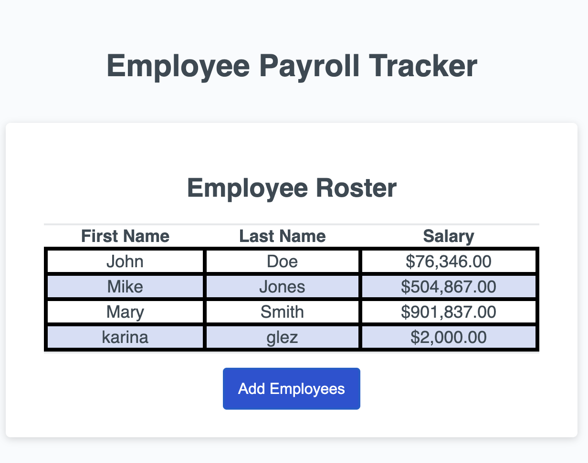

# Employee Payroll Tracker

## Description
This payroll tracker allows payroll managers to view and enter employee payroll data with the purpose of properly budgeting for their company.
This trackeer allows the entry of severeal employees until done. It will ask for first name, last name, and salary. This app will then sort the employee data alphabetically. Inside the consle, it will show the average of the employees and it pick a name at random.

This employee payroll tracker facilitates the payroll managers resposiblities by have a friendly user app that calculates the data automatically and sorting the employees alphabetically.

Setting up the variables to perfom the functions has taught me a lot about javascript. I was able to build the main function that makes this app work. This was a great way to see just how javascript works and what it's capabilites are. I have much more to learn.

https://github.com/2023kgl/employee-payroll-tracker

https://2023kgl.github.io/employee-payroll-tracker/

